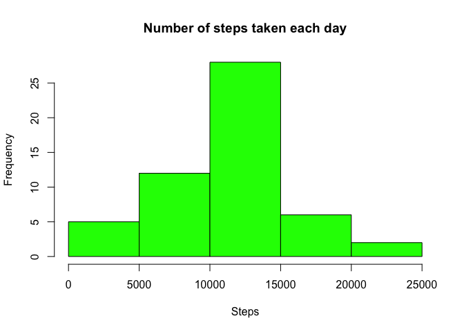
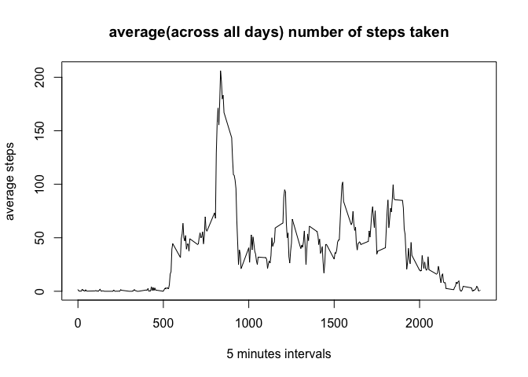
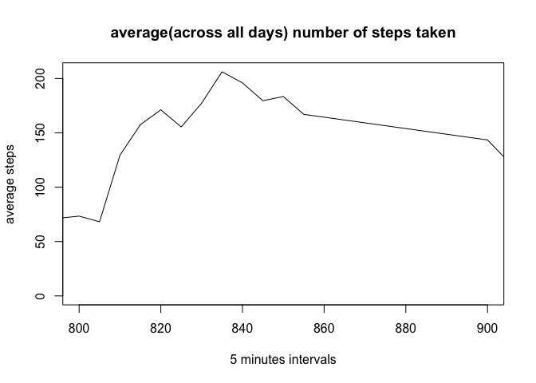
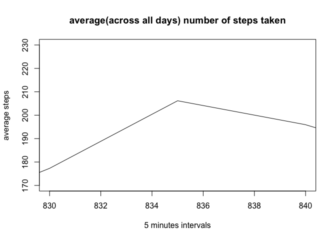
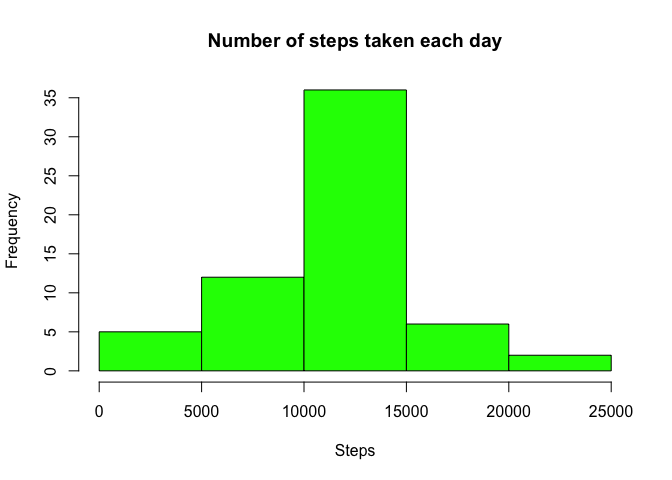
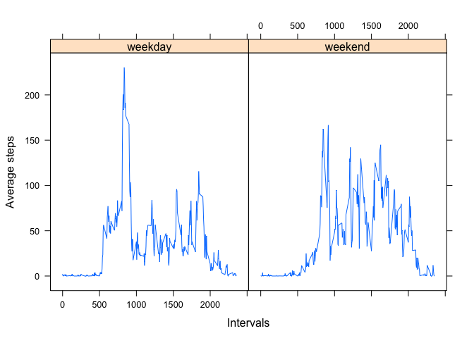

# Reproducible Research: Peer Assessment 1

It is now possible to collect a large amount of data about personal
movement using activity monitoring devices such as a
[Fitbit](http://www.fitbit.com), [Nike
Fuelband](http://www.nike.com/us/en_us/c/nikeplus-fuelband), or
[Jawbone Up](https://jawbone.com/up). These type of devices are part of
the "quantified self" movement -- a group of enthusiasts who take
measurements about themselves regularly to improve their health, to
find patterns in their behavior, or because they are tech geeks. But
these data remain under-utilized both because the raw data are hard to
obtain and there is a lack of statistical methods and software for
processing and interpreting the data.

This assignment makes use of data from a personal activity monitoring
device. This device collects data at 5 minute intervals through out the
day. The data consists of two months of data from an anonymous
individual collected during the months of October and November, 2012
and include the number of steps taken in 5 minute intervals each day.

## Data

The data for this assignment can be downloaded from the course web
site:

* Dataset: [Activity monitoring data](https://d396qusza40orc.cloudfront.net/repdata%2Fdata%2Factivity.zip) [52K]

The variables included in this dataset are:

* **steps**: Number of steps taking in a 5-minute interval (missing
    values are coded as `NA`)

* **date**: The date on which the measurement was taken in YYYY-MM-DD
    format

* **interval**: Identifier for the 5-minute interval in which
    measurement was taken

The dataset is stored in a comma-separated-value (CSV) file and there
are a total of 17,568 observations in this dataset.

## Loading and preprocessing the data

We're going to use following code to load CSV file into data frame:


```r
activitiesData <- read.csv("activity.csv")
str(activitiesData)
```

```
## 'data.frame':	17568 obs. of  3 variables:
##  $ steps   : int  NA NA NA NA NA NA NA NA NA NA ...
##  $ date    : Factor w/ 61 levels "2012-10-01","2012-10-02",..: 1 1 1 1 1 1 1 1 1 1 ...
##  $ interval: int  0 5 10 15 20 25 30 35 40 45 ...
```

```r
head(activitiesData)
```

```
##   steps       date interval
## 1    NA 2012-10-01        0
## 2    NA 2012-10-01        5
## 3    NA 2012-10-01       10
## 4    NA 2012-10-01       15
## 5    NA 2012-10-01       20
## 6    NA 2012-10-01       25
```

For further analysis we need to convert string representation of dates into real dates:


```r
activitiesData$date <- as.Date(activitiesData$date, "%Y-%m-%d")
str(activitiesData)
```

```
## 'data.frame':	17568 obs. of  3 variables:
##  $ steps   : int  NA NA NA NA NA NA NA NA NA NA ...
##  $ date    : Date, format: "2012-10-01" "2012-10-01" ...
##  $ interval: int  0 5 10 15 20 25 30 35 40 45 ...
```

## What is mean total number of steps taken per day?

To answer this question we need to group data by date and summarise steps. We will ignore the missing values in the dataset for now.


```r
library(dplyr)
```

```r
groupByDate <- aggregate(steps ~ date, activitiesData, sum)

hist(groupByDate$steps, col="green", main="Number of steps taken each day", xlab="Steps")
```

<!-- -->

To find the mean and median total number of steps taken per day let's take a look on data summary:


```r
summary(groupByDate$steps)
```

```
##    Min. 1st Qu.  Median    Mean 3rd Qu.    Max. 
##      41    8841   10760   10770   13290   21190
```

Summary shows us that **mean = 10770** and **median = 10760**

## What is the average daily activity pattern?

To figure out daily activity pattern let's re-group data by intervals and draw a plot:


```r
groupByInterval <- aggregate(steps ~ interval, activitiesData, mean)

plot(groupByInterval$interval, groupByInterval$steps, type="l", xlab="5 minutes intervals", ylab="average steps", main="average(across all days) number of steps taken")
```

<!-- -->

Let's zoom-in closer to a peak value:


```r
plot(groupByInterval$interval, groupByInterval$steps, type="l", xlab="5 minutes intervals", ylab="average steps", main="average(across all days) number of steps taken", xlim = c(800, 900))
```

<!-- -->

Let's zoom-in even closer to a peak value:


```r
plot(groupByInterval$interval, groupByInterval$steps, type="l", xlab="5 minutes intervals", ylab="average steps", main="average(across all days) number of steps taken", xlim = c(830, 840), ylim=c(170, 230))
```

<!-- -->

This last plot shows that **835th** time interval on average, contains the **maximum number of steps**

## Imputing missing values

Note that there are a number of days/intervals where there are missing values (coded as NA). The presence of missing days may introduce bias into some calculations or summaries of the data.

Let's calculate and report the total number of missing values in the dataset:


```r
missingData <- activitiesData[is.na(activitiesData$steps), ]
dim(missingData)
```

```
## [1] 2304    3
```

So there are totally **2304** missing values.

Let's take a look on summary for steps groupped by dates to figure out **min, mean and median** values:


```r
validData <- activitiesData[!is.na(activitiesData$steps),]

summary(validData$steps)
```

```
##    Min. 1st Qu.  Median    Mean 3rd Qu.    Max. 
##    0.00    0.00    0.00   37.38   12.00  806.00
```

It feels like the best option to replace missing values will be to take a mean amount of steps across all days for the same interval.

Let's create a new dataset that is equal to the original dataset but with the missing data filled in using defined stategy:


```r
data <- activitiesData
groupByInterval <- aggregate(steps ~ interval, data, mean)

for(i in 1:nrow(data)) {
    if (is.na(data[i,]$steps)) {
        data[i,]$steps <- groupByInterval$steps[groupByInterval$interval == data[i,]$interval]
    }
}

missingData <- data[is.na(data$steps), ]
dim(missingData)
```

```
## [1] 0 3
```
And now there are totally **0** missing values!

Let's make a histogram of the total number of steps taken each day:


```r
groupByDate <- aggregate(steps ~ date, data, sum)
hist(groupByDate$steps, col="green", main="Number of steps taken each day", xlab="Steps")
```

<!-- -->

And calculate the mean and median total number of steps taken per day:


```r
summary(groupByDate$steps)
```

```
##    Min. 1st Qu.  Median    Mean 3rd Qu.    Max. 
##      41    9819   10770   10770   12810   21190
```

Summary now shows us that **mean = 10770** and **median = 10770**

We clearly see that mean and median numbers are changed after filling in all missing values. Both values are equal now and represent more realistic picture.


## Are there differences in activity patterns between weekdays and weekends?

To answer this question we will use the dataset with the filled-in missing values for this part.

As a first step we create a new factor variable in the dataset with two levels -- "weekday" and "weekend" indicating whether a given date is a weekday or weekend day:


```r
data$dateType <- factor(ifelse(weekdays(data$date) %in% c("Sunday", "Saturday"), "weekend", "weekday"))
```

Let's make a panel plot containing a time series plot (i.e. type = "l") of the 5-minute interval (x-axis) and the average number of steps taken, averaged across all weekday days or weekend days (y-axis):


```r
library(lattice)

groupByDate <- aggregate(steps ~ dateType + interval, data, mean)

xyplot(steps~interval | dateType, data=groupByDate, xlab="Intervals", ylab="Average steps", type=c("l"))
```

<!-- -->

This graph clearly shows that people mostly perfer to exercise on weekday mornings and sometimes weekday evenings. And some activity happens on weekends morning, noon and right afternoon time.
