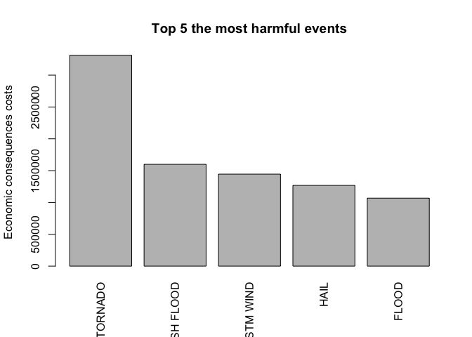

# Reproducible Research: Peer Assessment 2 - The most harmful weather events in US

Storms and other severe weather events can cause both public health and economic problems for communities and municipalities. Many severe events can result in fatalities, injuries, and property damage, and preventing such outcomes to the extent possible is a key concern. We are trying to explore the NOAA Storm Database and answer some basic questions about severe weather events:

* Across the United States, which types of events (as indicated in the 𝙴𝚅𝚃𝚈𝙿𝙴 variable) are most harmful with respect to population health?
* Across the United States, which types of events have the greatest economic consequences?

As we'll see in results "TORNADO" is the most harmful weather event what caused both population and economic impact.

## Data

The data for this assignment come in the form of a comma-separated-value file compressed via the bzip2 algorithm to reduce its size. You can download the file from the course web site:

* Dataset: [Storm data](https://d396qusza40orc.cloudfront.net/repdata%2Fdata%2FStormData.csv.bz2) [47MB]

The events in the database start in the year 1950 and end in November 2011. In the earlier years of the database there are generally fewer events recorded, most likely due to a lack of good records. More recent years should be considered more complete.

## Data Processing

We're going to use following code to load compressed (bz2) CSV file into data frame:


```r
data <- read.csv("repdata-data-StormData.csv.bz2")
```

### Analysis preconditions
Further analysis requires following libraries to be loaded:


```r
library(dplyr)
library(plyr)
library(mice)
```
### Initial analysis
Let's try to figure out data structure (names, dimensions, etc):


```r
names(data)
```

```
##  [1] "STATE__"    "BGN_DATE"   "BGN_TIME"   "TIME_ZONE"  "COUNTY"    
##  [6] "COUNTYNAME" "STATE"      "EVTYPE"     "BGN_RANGE"  "BGN_AZI"   
## [11] "BGN_LOCATI" "END_DATE"   "END_TIME"   "COUNTY_END" "COUNTYENDN"
## [16] "END_RANGE"  "END_AZI"    "END_LOCATI" "LENGTH"     "WIDTH"     
## [21] "F"          "MAG"        "FATALITIES" "INJURIES"   "PROPDMG"   
## [26] "PROPDMGEXP" "CROPDMG"    "CROPDMGEXP" "WFO"        "STATEOFFIC"
## [31] "ZONENAMES"  "LATITUDE"   "LONGITUDE"  "LATITUDE_E" "LONGITUDE_"
## [36] "REMARKS"    "REFNUM"
```

```r
dim(data)
```

```
## [1] 902297     37
```

```r
anyNA(data)
```

```
## [1] TRUE
```

Considering our questions it's better to reduce number of variables for analysis. Assuming that:

1. "FATALITIES" and "INJURIES" both affect population 
2. "PROPDMG" and "CROPDMG" both are showing economic costs 

So we reduce our data set to just these 5 variables: "EVTYPE", "FATALITIES", "INJURIES", "PROPDMG", "CROPDMG"


```r
filteredData <- data[,c("EVTYPE", "FATALITIES", "INJURIES", "PROPDMG", "CROPDMG")]
anyNA(filteredData)
```

```
## [1] FALSE
```

In addition we see that this data set doesn't contain any missing values so we can continue to work with filteredData data set

Now we are going to combine "FATALITIES" and "INJURIES" into common variable "populationAffected" and "PROPDMG" and "CROPDMG" into "economicEvents":


```r
data <- mutate(filteredData, populationAffected = FATALITIES + INJURIES, economicEvents = PROPDMG + CROPDMG) 
nrow(data[data$FATALITIES > 0 & data$INJURIES > 0, ])
```

```
## [1] 2649
```
Last result shows us that one weather event might cause both FATALITIES and INJURIES simultaniously.

## Answering first question: Across the United States, which types of events (as indicated in the 𝙴𝚅𝚃𝚈𝙿𝙴 variable) are most harmful with respect to population health?

As a next step we will try to answer our first question. So now we should consider "populationAffected" variable only. To do this we need to summarize all data groupped by event and then to find top 5 the most harmful events:


```r
#Summarize affected population by events
groupByPopulation <- aggregate(populationAffected ~ EVTYPE, data, sum)

#Reduce data considering only positive affected population
groupByPopulation <- groupByPopulation[groupByPopulation$populationAffected > 0,]

#Sorting by affected population
sortedByPopulation <- arrange(groupByPopulation, desc(populationAffected))

#Finding top 5 the most harmful
top5ByPopulation <- head(sortedByPopulation, n=5)
```

## Answering second question: Across the United States, which types of events have the greatest economic consequences?

As a next step we will try to answer our second question. So now we should consider "economicEvents" variable only. To do this we need to summarize all data groupped by event and then to find top 5 events with the highest economic costs:


```r
#Summarize economic consts by events
groupByEconomicEvent <- aggregate(economicEvents ~ EVTYPE, data, sum)

#Reduce data considering only positive costs
groupByEconomicEvent <- groupByEconomicEvent[groupByEconomicEvent$economicEvents > 0,]

#Sorting by economic events
sortedByEconomicEvent <- arrange(groupByEconomicEvent, desc(economicEvents))

#Finding top 5 the most harmful
top5ByEconomicEvent <- head(sortedByEconomicEvent, n=5)
```

## Results

Let's now show both observations in the following plots:


```r
top5ByPopulation
```

```
##           EVTYPE populationAffected
## 1        TORNADO              96979
## 2 EXCESSIVE HEAT               8428
## 3      TSTM WIND               7461
## 4          FLOOD               7259
## 5      LIGHTNING               6046
```

```r
barplot(height=top5ByPopulation$populationAffected, names.arg=top5ByPopulation$EVTYPE, ylab="Population affected",main="Top 5 the most harmful events", las=3)
```

<!-- -->


```r
top5ByEconomicEvent
```

```
##        EVTYPE economicEvents
## 1     TORNADO        3312277
## 2 FLASH FLOOD        1599325
## 3   TSTM WIND        1445168
## 4        HAIL        1268290
## 5       FLOOD        1067976
```

```r
barplot(height=top5ByEconomicEvent$economicEvents, names.arg=top5ByEconomicEvent$EVTYPE, ylab="Economic consequences costs",main="Top 5 the most harmful events", las=3)
```

<!-- -->

As we clearly see "TORNADO" is the most harmful weather event what caused both population and economic impact. 

If we break our results by population and economic costs then:

1. "TORNADO" will be the only one the most harmful weather event caused the most death and injuries among US population
2. Apart from "TORNADO" other weather events such as "FLASH FLOOD", "TSTM WIND", "HAIL" and "FLOOD" are in the top 5 the most harmful weather events caused property and crops damages.


